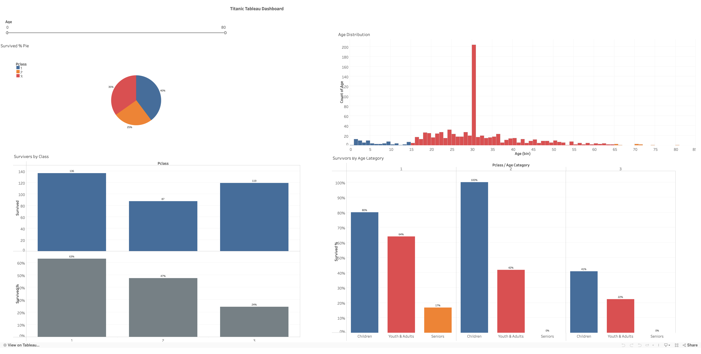

# 🚢 Titanic Data Analysis & Visualization Project

## Project Overview  
This project investigates the factors that influenced passenger survival during the Titanic disaster using **Python**, **SQL**, and **Tableau**.  
The analysis focuses on how **passenger class** and **age** affected survival outcomes, revealing social and demographic inequalities in access to safety.  
The workflow combines **data preprocessing**, **exploratory data analysis (EDA)**, and an **interactive Tableau dashboard** to transform a historical dataset into actionable insights.

---

## Objectives  

- **Goal:**  
  Determine if survival rate was influenced by passenger class and age, and identify the most vulnerable passenger groups.

- **Key Questions:**  
  - Did higher-class passengers have a better chance of survival?  
  - Were children prioritized during evacuation?  
  - How did age affect survival outcomes within each class?

---

## Data Preparation & Workflow  

### **Step 1 — Data Loading**  
- Downloaded dataset from Google Drive using the `gdown` library.  
- Loaded into a Pandas DataFrame for inspection, type verification, and missing value analysis.

### **Step 2 — Data Cleaning & Feature Engineering**  
- Imputed missing `Age` values using **mean imputation**.  
- Standardized categorical fields such as `Sex`, `Embarked`, and `Pclass`.  
- Created a new derived feature `age_category` grouping passengers as:
  - **Children (0–14)**  
  - **Youth & Adults (15–64)**  
  - **Seniors (65+)**
- Removed redundant columns and prepared data for SQL and visualization.

### **Step 3 — SQL Integration**  
- Stored cleaned dataset in a **SQLite database** using the `sqlite3` library.  
- Enabled the SQL extension in Jupyter/Colab using `%load_ext sql`.  
- Queried survival rates by passenger class and age directly from the SQL database.  
- This hybrid SQL + Python setup allowed efficient cross-verification and flexible data exploration.

### **Step 4 — Exploratory Data Analysis (EDA)**  
- Used **Matplotlib** for visual summaries of survival counts, age distributions, and class-based comparisons.  
- Exported the processed data to Tableau for advanced visualization and interactive storytelling.

---

## Tableau Dashboard  

You can explore the interactive dashboard here:  
👉 **[View on Tableau Public](https://public.tableau.com/shared/QZJ45DKH9?:display_count=n&:origin=viz_share_link)**  

### **Dashboard Preview**


### **Dashboard Components**
- **Survived % Pie Chart:** Shows passenger distribution across classes.  
- **Age Distribution Histogram:** Displays age bins and passenger counts.  
- **Survivors by Class (Bar Chart):** Compares total survivors across 1st, 2nd, and 3rd class.  
- **Survivors by Age Category:** Visualizes survival percentages across Children, Adults, and Seniors within each class.  
- **Dynamic Filters:**  
  - *Age range slider* for granular filtering.  
  - *Color-coded legend* to distinguish passenger classes.

### **Tools Used**
- Tableau for interactive visualization  
- Python (Pandas, NumPy, Matplotlib) for preprocessing and EDA  
- SQLite for structured querying  
- Excel for dataset export and formatting

---

## Key Findings  

### **Class-Based Survival Disparities**
- First-class passengers had **nearly three times the survival rate** of third-class passengers.  
- **Survival Rates by Class:**  
  - 1st Class → ~63%  
  - 2nd Class → ~47%  
  - 3rd Class → ~24%  
- Confirms strong class-based inequality in survival outcomes, reflecting social hierarchy and access differences.

### **Age-Based Trends**
- **Children were most likely to survive**, especially in upper classes:  
  - 1st Class → ~80%  
  - 2nd Class → **100%**  
  - 3rd Class → ~40%  
- **Seniors were the most vulnerable group:**  
  - 0% survived in 2nd and 3rd class.  
  - Only **17% (one senior)** survived in 1st class.  
- Suggests children were prioritized, but survival strongly depended on class.

### **Insights Summary**
- Survival was not random — it reflected **social privilege and structural bias**.  
- Age and class were critical survival determinants.  
- The analysis aligns with historical reports emphasizing unequal evacuation conditions.

---

## Tools & Technologies  

| Category | Tools / Libraries |
|-----------|------------------|
| **Languages** | Python |
| **Data Handling** | Pandas, NumPy |
| **Visualization** | Matplotlib, Tableau |
| **Database** | SQLite |
| **Environment** | Google Colab, Jupyter Notebook |
| **Other** | Excel, gdown |

---

## Conclusion  

This project integrates **Python-based analysis**, **SQL querying**, and **Tableau visualization** to explore one of the most well-documented historical datasets.  
Findings reveal how class and age shaped survival outcomes, demonstrating how data analytics can uncover patterns of inequality even in historical contexts.  
Through this end-to-end workflow, the project bridges data cleaning, analysis, and visual storytelling into a single, cohesive narrative.

---

## Future Work  

- Include **gender-based** analysis to examine multi-factor survival interactions.  
- Perform **statistical hypothesis testing** (e.g., Chi-square) for significance validation.  
- Develop a **logistic regression model** to predict survival probabilities.  
- Extend Tableau dashboard with filters for embarkation port, fare, and family size.

---

## Dependencies  

```text
pandas
numpy
matplotlib
sqlite3
jupyter
tableau
gdown
